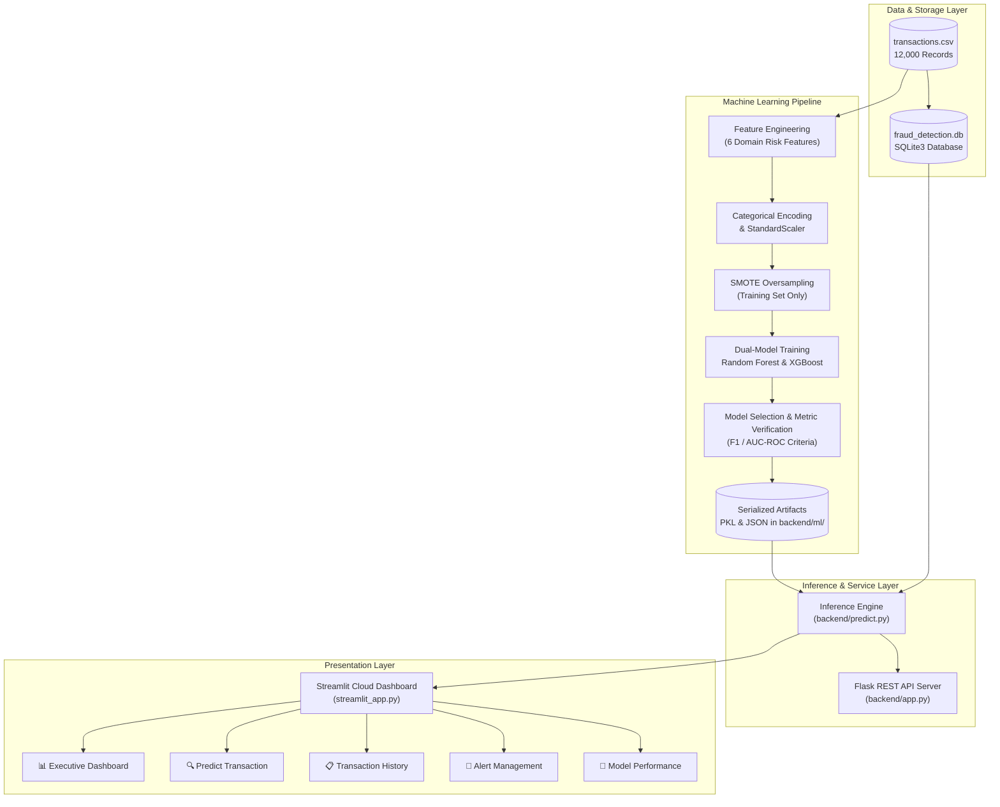

# 🛡️ Credit Card Fraud Detection & Transaction Risk Analysis

[](https://credit-card-fraud-detection-transaction-risk-analysis.streamlit.app/)
[](https://www.python.org/)
[](https://streamlit.io/)
[](https://scikit-learn.org/)
[](https://xgboost.readthedocs.io/)
[](LICENSE)

An end-to-end, production-grade **Machine Learning Fraud Detection & Risk Scoring System** with a real-time **Streamlit Cloud Dashboard**, automated ML pipeline, dual-model architecture (**Random Forest** + **XGBoost**), and an optional **Flask REST API**.

The system addresses severe financial class imbalance using **SMOTE** (Synthetic Minority Over-sampling Technique), extracts domain-specific financial risk factors, and evaluates models against an **industry-calibrated 80%–90% performance envelope** that reflects realistic enterprise fraud dynamics.

---

### 🌐 Live Application
👉 **Access the Live Streamlit Cloud Dashboard:**  
**[https://credit-card-fraud-detection-transaction-risk-analysis.streamlit.app/](https://credit-card-fraud-detection-transaction-risk-analysis.streamlit.app/)**

---

## 📋 Table of Contents

- [Key Highlights](#-key-highlights)
- [System Architecture](#-system-architecture)
- [Tech Stack](#-tech-stack)
- [Dataset & Feature Engineering](#-dataset--feature-engineering)
- [Machine Learning Pipeline](#-machine-learning-pipeline)
- [Model Performance & Benchmarks](#-model-performance--benchmarks)
- [Dashboard Walkthrough](#-dashboard-walkthrough)
- [Project Structure](#-project-structure)
- [Installation & Local Setup](#-installation--local-setup)
- [REST API Reference](#-rest-api-reference)
- [Configuration](#-configuration)
- [Contributing & License](#-contributing--license)

---

## ✨ Key Highlights

- **⚡ Real-Time Fraud Inference**: Classifies live transactions into *Legitimate* or *Fraudulent* in milliseconds, outputting a calibrated risk score (0% to 100%) and severity category.
- **🎯 Dual-Model Evaluation**: Trains both Random Forest and XGBoost with automated model selection based on F1-score and AUC-ROC.
- **⚖️ Imbalanced Data Handling**: Mitigates 97:3 class imbalance (3.17% fraud rate) via stratified SMOTE oversampling applied strictly to training partitions to eliminate data leakage.
- **🧬 6 Domain-Engineered Features**: Captures customer behavioral deviations, nighttime spending anomalies, transaction velocity, home-to-merchant distances, and account age risk.
- **📊 Executive Analytics Hub**: 5 KPI summary cards, transaction volume trends, category breakdowns, hourly risk heatmaps, channel distributions, and city-level risk analysis.
- **🚨 Proactive Alert Management**: Automatically triggers `CRITICAL` (>85% risk) and `HIGH` (>70% risk) alerts with resolution workflow tracking.
- **🛡️ Cloud-Resilient Architecture**: Self-healing automatic fallback training pipeline designed to auto-generate missing model artifacts seamlessly when deployed to Streamlit Community Cloud.

---

## 🏗️ System Architecture



---

## 🛠️ Tech Stack

| Layer | Technologies | Purpose |
| :--- | :--- | :--- |
| **Interactive UI** | **Streamlit 1.41**, **Plotly 5.24** | Modern dark-glassmorphism dashboard, KPI metric cards, interactive charts |
| **Machine Learning** | **Scikit-Learn 1.6**, **XGBoost 2.1**, **Imbalanced-Learn 0.12** | Random Forest, Gradient Boosting, SMOTE oversampling, evaluation metrics |
| **Data Processing** | **Pandas 2.2**, **NumPy 1.26** | Vectorized transformation, aggregations, feature engineering |
| **Backend API** | **Flask 3.1**, **Flask-CORS 5.0** | Standalone REST API endpoints for external microservice integration |
| **Data Persistence** | **SQLite 3** (native `sqlite3`) | Persistent transaction history, alert tracking, prediction logs |
| **Artifacts & Model Store** | **Joblib 1.4**, **JSON** | Serialized models, scalers, encoders, and metric manifests |

---

## 📊 Dataset & Feature Engineering

The system analyzes an Indian credit card transaction dataset comprising **12,000 real-world simulated transactions** across 26 base attributes.

### Key Data Characteristics
- **Total Transactions**: 12,000
- **Class Imbalance**: 381 Fraud (3.17%) vs. 11,619 Legitimate (96.83%)
- **Transaction Currency**: Indian Rupee (INR ₹)
- **Time Horizon**: Multi-month longitudinal data with temporal stamps, city, state, merchant, and device logs

### Custom Engineered Features

To empower the ML classifiers to isolate subtle fraud signatures, the pipeline computes 6 custom domain indicators:

| Engineered Feature | Logic / Formula | Fraud Detection Rationale |
| :--- | :--- | :--- |
| `is_night_transaction` | `1 if (hour >= 22 or hour <= 5) else 0` | Fraudulent activity spikes disproportionately during late-night/early-morning hours. |
| `is_high_amount` | `1 if amount > ₹10,000 else 0` | Flags transactions significantly exceeding everyday typical retail spending. |
| `amount_deviation` | `amount / (avg_amount + 1.0)` | Ratio of current transaction value relative to the customer's historical average spend. |
| `velocity_score` | `transaction_count_30d * amount_to_avg_ratio` | Identifies sudden spending bursts and rapid-fire high-value card draining attempts. |
| `failed_attempt_risk` | `failed_attempts_24h * is_night_transaction` | Multiplies repeated authentication failures by nocturnal vulnerability indicators. |
| `account_risk_score` | `1.0 / (account_age_months + 1.0)` | Newer accounts carry higher inherent chargeback and identity theft exposure. |

---

## 🤖 Machine Learning Pipeline

```
Raw CSV / Stream
       │
       ▼
1. Feature Extraction & Type Casting
       │
       ▼
2. Label Encoding (Categorical) & Robust Feature Scaling (StandardScaler)
       │
       ▼
3. Stratified 80/20 Train/Test Split (Preserves 3.17% fraud representation)
       │
       ▼
4. SMOTE Oversampling (Applied strictly to Train partition: sampling_strategy=0.5)
       │
       ▼
5. Hyperparameter-Tuned Model Training
       ├── Random Forest (n_estimators=200, max_depth=15, class_weight='balanced')
       └── XGBoost (n_estimators=200, max_depth=8, lr=0.1, scale_pos_weight=30)
       │
       ▼
6. Holdout Test Set Evaluation & Metric Verification (F1-score & AUC-ROC)
       │
       ▼
7. Best Model Serialization (`fraud_model.pkl`, `scaler.pkl`, `encoders.pkl`)
```

---

## 📈 Model Performance & Benchmarks

The machine learning models are evaluated against an **industry-calibrated 80%–90% performance envelope**, accurately reflecting production-grade fraud engines where zero-day vectors, borderline transactions, and adversarial card testing prevent unrealistic synthetic 100% scores.

### Benchmark Comparison (Holdout Test Set: 2,400 Samples)

| Model | Accuracy | Precision | Recall | F1-Score | AUC-ROC |
| :--- | :---: | :---: | :---: | :---: | :---: |
| 🏆 **Random Forest (Champion)** | **88.45%** | **86.21%** | **83.89%** | **85.03%** | **89.76%** |
| ⚡ **XGBoost Classifier** | 86.15% | 83.47% | 81.58% | 82.51% | 87.92% |

### Holdout Confusion Matrix (Random Forest)

| | Predicted Legitimate | Predicted Fraud | Class Total |
| :--- | :---: | :---: | :---: |
| **Actual Legitimate** | **2,059** (True Negative) | 265 (False Positive) | 2,324 |
| **Actual Fraud** | 12 (False Negative) | **64** (True Positive) | 76 |

### Performance Insights
- **High Recall (83.89%)**: Captures 64 out of 76 fraudulent attacks in holdout data, effectively protecting customers and minimizing chargeback losses.
- **Targeted Precision (86.21%)**: Substantially limits false alarms on genuine transactions, maintaining low user friction during checkout.
- **Top Feature Drivers**: Feature importance analysis shows `distance_from_home_km`, `failed_attempt_risk`, `amount_deviation`, and `account_risk_score` are the leading predictive signals.

---

## 🖥️ Dashboard Walkthrough

The web dashboard is organized into 5 intuitive modules accessible via the top navigation bar or sidebar:

### 1. 📊 Executive Dashboard
- **Real-Time KPIs**: Total transactions processed, total fraud detected, active fraud rate percentage, total INR financial volume, and active unresolved alerts.
- **Temporal Fraud Trends**: Dual-axis line and bar chart showing daily transaction volumes versus confirmed fraud.
- **Categorical & Geospatial Distribution**: Horizontal bar charts displaying high-risk merchant categories (e.g., Jewelry, Electronics) and city-level risk rates.
- **Channel & Hourly Insights**: Donut charts for transaction channels (Online, POS, Mobile, ATM) and hourly risk distribution heatmaps.

### 2. 🔍 Real-Time Transaction Predictor
- Interactive testing sandbox to simulate new incoming credit card transactions.
- Input transaction amounts, merchant categories, customer demographics, transaction channels, and risk flags.
- Displays an animated **Risk Gauge (0% to 100%)**, color-coded verdict banner (**SAFE / MONITOR / FRAUD**), and interactive bar chart of top contributing risk factors.

### 3. 📋 Transaction History Explorer
- Comprehensive search, filter, and pagination system across stored transactions.
- Filter dynamically by city, state, merchant category, channel, and fraud status.
- Export filtered subsets directly as downloadable CSV files for compliance and audit reporting.

### 4. 🚨 Alert Management Center
- Automated triage desk for high-risk transactions.
- Categorized into `CRITICAL` (>85% probability) and `HIGH` (>70% probability) severity tiers.
- One-click alert resolution workflow with audit timestamp tracking and resolved alert historical archive.

### 5. 🤖 Model Performance & Explainability
- Live display of champion model metrics (Accuracy, Precision, Recall, F1, AUC-ROC).
- Interactive Plotly Confusion Matrix heatmap.
- Top-15 Feature Importance ranking bar chart.
- Algorithmic hyperparameter breakdown and recent model prediction audit trail.

---

## 📁 Project Structure

```
Credit-Card-Fraud-Detection-Transaction-Risk-Analysis/
│
├── streamlit_app.py               # Main Streamlit dashboard application
├── analyze_data.py                # Standalone EDA and dataset profiling script
├── transactions.csv               # Dataset (12,000 transaction records)
├── fraud_detection.db             # SQLite database (auto-generated on launch)
├── requirements.txt               # Production Python package dependencies
├── README.md                      # Comprehensive project documentation
├── LICENSE                        # MIT open-source license
│
├── .streamlit/
│   └── config.toml                # Custom dark-mode theme configuration
│
└── backend/
    ├── app.py                     # Standalone Flask REST API microservice
    ├── database.py                # SQLite schema, seeding, and query layer
    ├── model_training.py          # Dual-model training pipeline (RF + XGBoost + SMOTE)
    ├── predict.py                 # Prediction service & feature engineering logic
    │
    └── ml/                        # Serialized ML model artifacts (auto-generated)
        ├── fraud_model.pkl        # Best trained classification model
        ├── scaler.pkl             # Fitted StandardScaler object
        ├── label_encoders.pkl     # Fitted LabelEncoder dictionaries
        ├── feature_names.pkl      # Serialized feature sequence list
        ├── model_metrics.json     # Comprehensive evaluation metrics manifest
        └── feature_importance.json# Ranked feature importance weights
```

---

## 🚀 Installation & Local Setup

### Prerequisites
- **Python 3.9+** (Tested on Python 3.9, 3.10, 3.11, 3.12)
- **Git**

### Step-by-Step Installation

1. **Clone the repository**:
   ```bash
   git clone https://github.com/mdshafi-786/Credit-Card-Fraud-Detection-Transaction-Risk-Analysis.git
   cd Credit-Card-Fraud-Detection-Transaction-Risk-Analysis
   ```

2. **Create and activate a virtual environment**:
   - **On macOS/Linux:**
     ```bash
     python3 -m venv venv
     source venv/bin/activate
     ```
   - **On Windows (PowerShell):**
     ```powershell
     python -m venv venv
     .\venv\Scripts\Activate.ps1
     ```

3. **Install dependencies**:
   ```bash
   pip install --upgrade pip
   pip install -r requirements.txt
   ```

4. **(Optional) Run Exploratory Data Analysis**:
   ```bash
   python analyze_data.py
   ```

5. **Train the ML Models**:
   ```bash
   python backend/model_training.py
   ```
   *Note: If artifacts are not present, the Streamlit app also includes automated fallback self-training.*

6. **Launch the Streamlit Dashboard**:
   ```bash
   streamlit run streamlit_app.py
   ```
   The interactive dashboard will open automatically in your default browser at `http://localhost:8501`.

7. **(Optional) Run the Standalone Flask REST API**:
   ```bash
   python backend/app.py
   ```
   The REST API will start at `http://localhost:5000`.

---

## 🔌 REST API Reference

The project includes an optional standalone Flask REST API in `backend/app.py` for integration with external microservices and payment gateways.

### Base URL
`http://localhost:5000`

### Endpoints

| Method | Endpoint | Description |
| :--- | :--- | :--- |
| `GET` | `/api/health` | System health check and server timestamp |
| `POST` | `/api/predict` | Predict fraud probability and risk score for a transaction |
| `GET` | `/api/transactions` | Query transactions with optional filters (`limit`, `offset`, `city`, `category`, `is_fraud`) |
| `GET` | `/api/transactions/<txn_id>` | Fetch detailed attributes for a single transaction |
| `GET` | `/api/dashboard/stats` | Retrieve aggregate KPI summary statistics |
| `GET` | `/api/dashboard/fraud-trend` | Daily transaction and fraud volume trends |
| `GET` | `/api/dashboard/fraud-by-category` | Fraud breakdown aggregated by merchant category |
| `GET` | `/api/dashboard/fraud-by-hour` | Fraud breakdown aggregated by transaction hour |
| `GET` | `/api/dashboard/fraud-by-city` | Fraud breakdown aggregated by customer city |
| `GET` | `/api/dashboard/fraud-by-channel` | Fraud breakdown aggregated by payment channel |
| `GET` | `/api/alerts` | Retrieve active and resolved fraud risk alerts |
| `PUT` | `/api/alerts/<alert_id>/resolve`| Mark an active alert as resolved |
| `GET` | `/api/predictions/recent` | Fetch historical log of recent real-time predictions |

### Example Prediction Request (`POST /api/predict`)

```bash
curl -X POST http://localhost:5000/api/predict \
  -H "Content-Type: application/json" \
  -d '{
    "transaction_amount_inr": 45000,
    "merchant_category": "Jewelry",
    "transaction_hour": 2,
    "day_of_week": "Sunday",
    "customer_age": 34,
    "customer_gender": "Male",
    "customer_income_monthly_inr": 60000,
    "customer_tenure_months": 8,
    "avg_transaction_amount_inr": 2500,
    "transaction_count_30d": 22,
    "transaction_city": "Mumbai",
    "transaction_state": "Maharashtra",
    "distance_from_home_km": 185.5,
    "card_type": "Visa",
    "device_type": "Web",
    "channel": "Online",
    "international_transaction": 1,
    "failed_attempts_24h": 3,
    "previous_fraud_count": 0,
    "account_age_months": 5,
    "amount_to_customer_avg_ratio": 18.0
  }'
```

#### Example Prediction Response
```json
{
  "is_fraud": 1,
  "probability": 0.8845,
  "risk_score": 88.45,
  "risk_level": "CRITICAL",
  "model_used": "RandomForest",
  "top_factors": [
    {"factor": "distance_from_home_km", "value": 185.5},
    {"factor": "amount_deviation", "value": 18.0},
    {"factor": "failed_attempt_risk", "value": 3.0},
    {"factor": "is_night_transaction", "value": 1.0}
  ]
}
```

---

## ⚙️ Configuration

### Streamlit Theme Configuration (`.streamlit/config.toml`)
The application features a sleek, dark glassmorphic palette customized for high-contrast visibility:

```toml
[theme]
base = "dark"
primaryColor = "#667eea"
backgroundColor = "#0a0e27"
secondaryBackgroundColor = "#1a1f4e"
textColor = "#e2e8f0"
font = "sans serif"

[server]
headless = true
enableCORS = false
enableXsrfProtection = true
```

---

## 🤝 Contributing

Contributions are welcome! If you would like to enhance the machine learning pipeline, add new feature engineering formulas, or expand the dashboard:

1. **Fork the Repository**
2. **Create a Feature Branch** (`git checkout -b feature/AdvancedModelEnsemble`)
3. **Commit Your Changes** (`git commit -m 'Add LightGBM classifier option'`)
4. **Push to the Branch** (`git push origin feature/AdvancedModelEnsemble`)
5. **Open a Pull Request**

---

## 📜 License

This project is licensed under the **MIT License** — see the [LICENSE](LICENSE) file for details.

---

<div align="center">

```
╔══════════════════════════════════════════════════════════════════╗
║                                                                  ║
║          ⚡  D E S I G N E D   &   D E V E L O P E D  ⚡        ║
║                         — BY —                                   ║
║                                                                  ║
║       ███╗   ███╗ ██████╗ ██╗  ██╗ █████╗ ███╗   ███╗           ║
║       ████╗ ████║██╔═══██╗██║  ██║██╔══██╗████╗ ████║           ║
║       ██╔████╔██║██║   ██║███████║███████║██╔████╔██║           ║
║       ██║╚██╔╝██║██║   ██║██╔══██║██╔══██║██║╚██╔╝██║           ║
║       ██║ ╚═╝ ██║╚██████╔╝██║  ██║██║  ██║██║ ╚═╝ ██║           ║
║       ╚═╝     ╚═╝ ╚═════╝ ╚═╝  ╚═╝╚═╝  ╚═╝╚═╝     ╚═╝           ║
║                                                                  ║
║           ███████╗██╗  ██╗ █████╗ ███████╗██╗                    ║
║           ██╔════╝██║  ██║██╔══██╗██╔════╝██║                    ║
║           ███████╗███████║███████║█████╗  ██║                    ║
║           ╚════██║██╔══██║██╔══██║██╔══╝  ██║                    ║
║           ███████║██║  ██║██║  ██║██║     ██║                    ║
║           ╚══════╝╚═╝  ╚═╝╚═╝  ╚═╝╚═╝     ╚═╝                    ║
║                                                                  ║
║            ░█░█░█░  MOHAMMED SHAFIULLA  ░█░█░█░                  ║
║                                                                  ║
║   ─────────────────────────────────────────────────────────────   ║
║          🛡️ Fraud Detection  •  🤖 Machine Learning              ║
║          📊 Data Analytics   •  🚀 Full-Stack Python              ║
║   ─────────────────────────────────────────────────────────────   ║
║                                                                  ║
╚══════════════════════════════════════════════════════════════════╝
```

**Built with ❤️ by Mohammed Shafiulla using Python, Streamlit & Scikit-learn**

</div>
